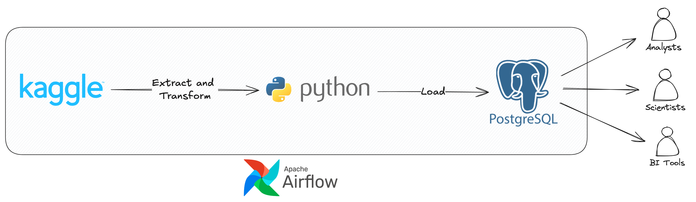

# Retail Orders ETL Pipeline and Analysis - Data Engineering Project

## Introduction
This project focuses on building a comprehensive ETL (Extract, Transform, Load) pipeline for retail order data using a dataset sourced from Kaggle. Through Python and PostgreSQL within a Docker environment, the project aims to efficiently process and analyze retail transactions, enabling insights into sales patterns and operational performance. The integration of these technologies ensures a scalable and maintainable architecture for data engineering tasks.

## Architecture

## Technology Used
1. Programming Language - Python
2. Scripting Language - SQL
3. Containerization - Docker
<!-- 4. Orchestration - Airflow -->

## Dataset Used
[Retails Orders](https://kaggle.com/datasets/ankitbansal06/retail-orders): This dataset contains the years 2022 and 2023 global mart sales.

<!-- ## Data Model
 -->

## Scripts for project
1. [Extract Python File](extract.ipynb)
<!-- 2. [Load Python File](mage-files/load.py)
3. [Transform Python File](mage-files/transform.py) -->

## Project explained
Python is used to handle the ETL process - extracting from Kaggle using the kaggle package, pandas to transform the data by cleaning, and removing duplicates, and finally loading the cleanses data into Postgres database. 

<!-- Airflow to manage workflow orchestration by building, scheduling and monitoring the data pipeline -->

## How to run the project:
1. Set up and activate python virtual environment: 
   - MacOS/Linux: `python3 -m venv env`, then `source env/bin/activate`
   - Windows: `python virtualenv env`, then `./env/scripts/activate`
2. Install required packages: `pip install -r requirements.txt`
3. Copy `.env.example` to `.env` and set the environment variables
4. Run the project using Jupyter notebook

## Original Post - SQLServer
Ankit Bansal - https://www.youtube.com/watch?v=uL0-6kfiH3g&t=0s